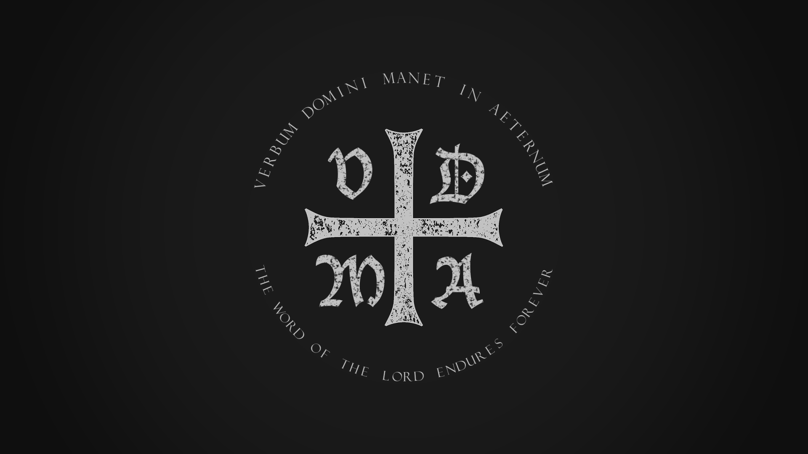
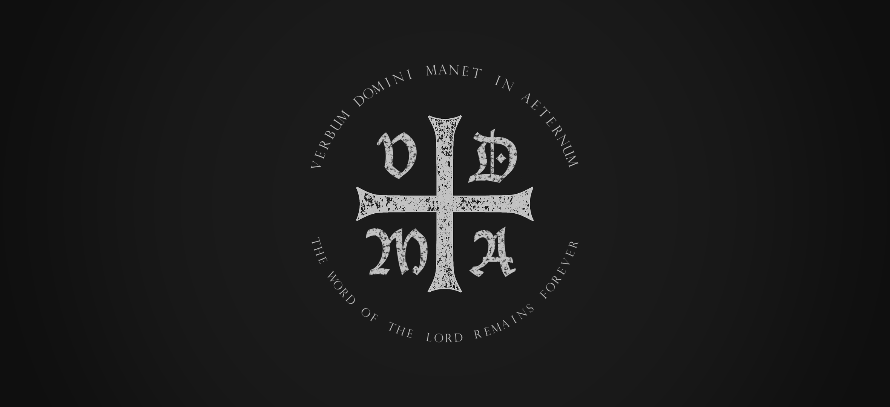
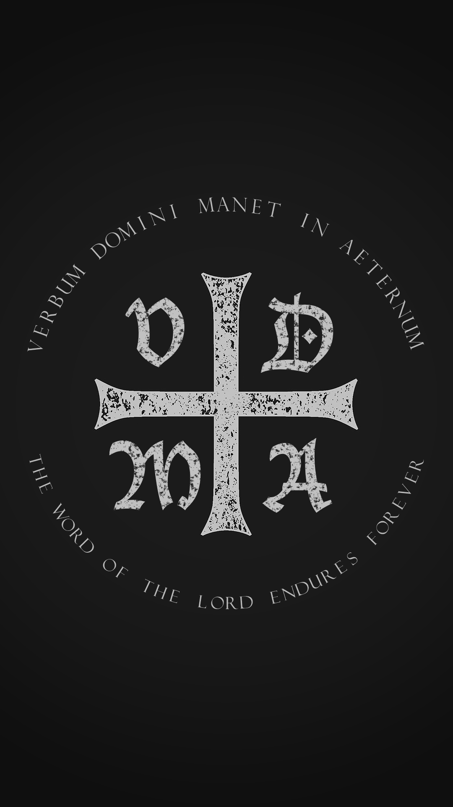
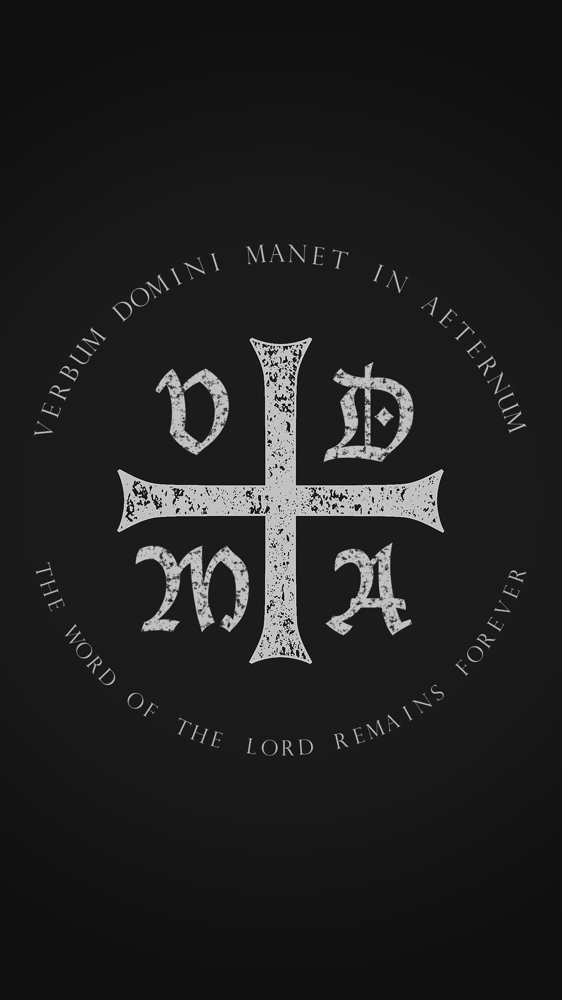
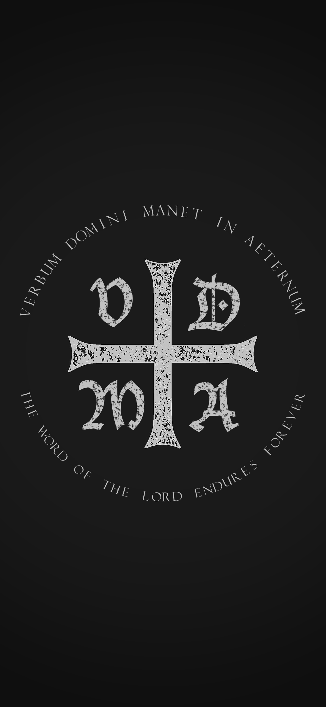
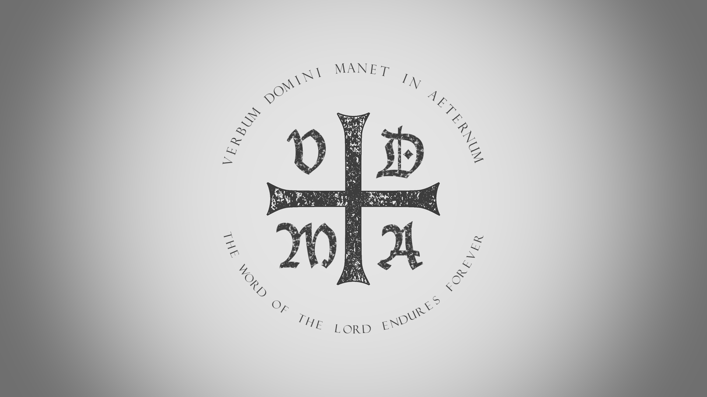
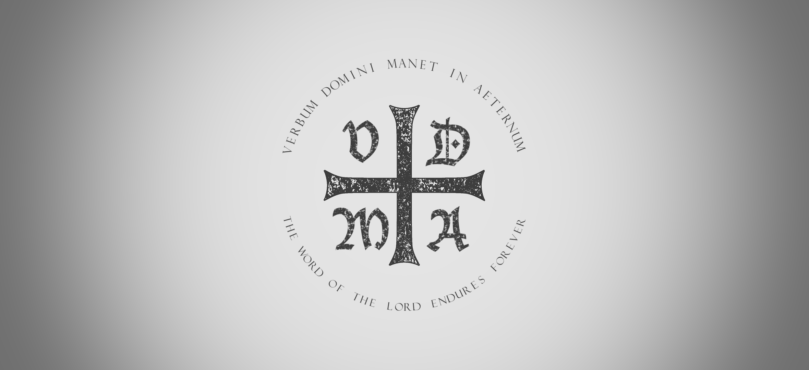
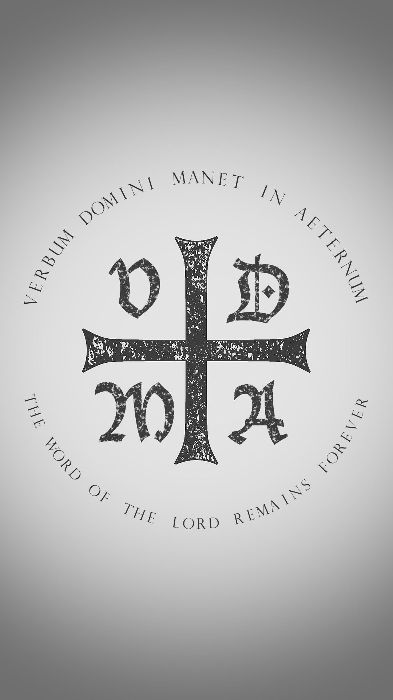
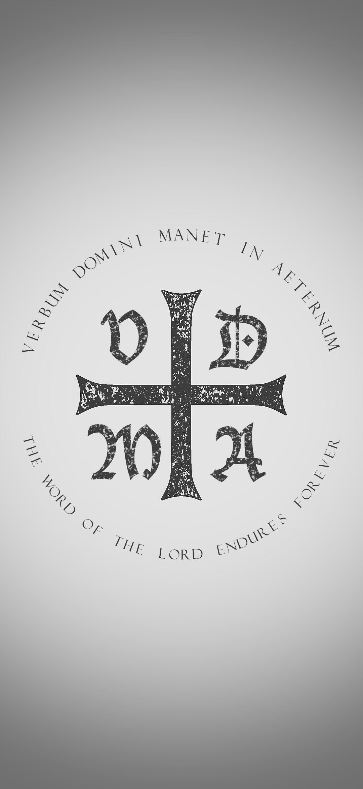

# VDMA

> VDMA is an acronym that stands for the Latin slogan: Verbum Domini Manet in Aeternum (“the Word of the Lord remains forever”), which was used throughout the Lutheran Reformation.  It originally appears in Isaiah 40:8 and was also used by the Apostle Peter in his first epistle (1 Pt. 1:24-5).  Both scriptural passages refer to the eternal faithfulness of God and his living Word.  The unchanging faithfulness of God to his Word is at the very heart of the gospel as understood by the Lutheran reformers.

> Luther’s recognition of the unchanging power of God’s Word was at the very center of his Reformation.  Luther believed that God’s Word of law and gospel remains true in spite of all attempts to place conditions upon it or cover it over with human traditions.  For Luther, Word of God was living and active.  In speaking his Word, God not only promises justification to sinners, but also enacts it by creating faith in their hearts and minds.  Those redeemed by Christ are then able to live life of freedom by the power of grace received by God’s faithful Word.

(From [LutheranReformation.org](https://lutheranreformation.org/history/vdma/))

This is a wallpaper that I made for my personal use. In this repository are several variations with different resolutions and light/dark themes. I've seen this Latin phrase translated both with the word "remains" as well as "endures", so both translations are present here.

## Dark Theme

### Desktop

#### 1920x1080

#### 2560x1080

### Mobile

#### 1080x1920

#### 1080x2340

## Light Theme

### Desktop

#### 1920x1080

#### 2560x1080

### Mobile

#### 1080x1920

#### 1080x2340

